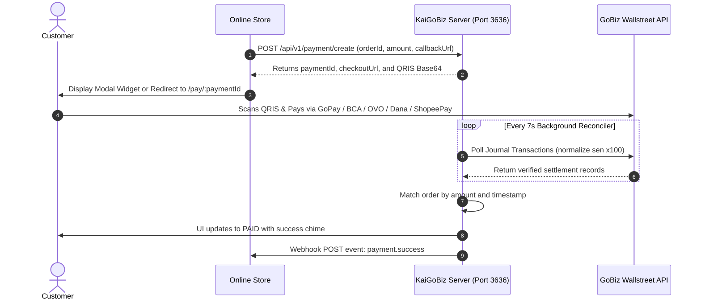

<div align="center">

# ⚡ KaiGoBiz
### High-Performance GoBiz Payment Gateway, Dynamic QRIS Generator & Mutasi Scraper

[](https://github.com/kaivyy/kaigobiz/releases/tag/v1.1.0)
[](https://www.typescriptlang.org/)
[](https://hono.dev)
[](https://vitest.dev)
[](LICENSE)

<p align="center">
  Turn any personal or merchant GoBiz account into an automated, zero-fee payment gateway.<br/>
  Generate dynamic QRIS codes, reconcile transactions in real time, and dispatch instant webhooks to your online store.
</p>

[Key Features](#-key-features) • [Why KaiGoBiz](#-why-kaigobiz) • [Architecture](#-architecture--payment-flow) • [Quick Start](#-quick-start) • [Integration Modes](#-integration-modes) • [API Reference](#-rest-api-reference)

</div>

---

## 🚀 Key Features

- **Dynamic QRIS Generator**: Generates custom-amount QRIS payments on the fly from any static GoBiz QRIS template using EMVCo Tag 54 injection and CRC16 CCITT recalculation.
- **Automated Background Reconciliation**: Built-in reconciler polls the GoBiz Wallstreet Journal API every 7 seconds, matches transactions by amount and timestamp, and updates orders to `PAID`.
- **GoBiz Sen Currency Normalization**: Automatically converts Gojek Wallstreet minor currency units (sen x100, e.g. 100000 sen = Rp 1.000) to standard Rupiah transparently.
- **Three Flexible Checkout Modes**:
  1. **Hosted Checkout Page** (`/pay/:paymentId`): Pre-built responsive payment page with QR code, live countdown, and audio notifications.
  2. **Embeddable Modal Widget** (`kaigobiz.js`): Lightweight (~15KB) modal popup script that works on any website with a single `<script>` tag.
  3. **Headless REST API**: Full JSON API for custom mobile apps, e-commerce backends (Laravel, Express, Django), and 100% white-label checkouts.
- **Instant Webhook Engine**: Dispatches HTTP POST notifications to your backend when customer payments settle, with support for per-order callbacks.
- **QRIS Studio**: Multi-engine QR extraction featuring client-side `jsQR` HTML5 Canvas (drag & drop, clipboard paste `Ctrl+V`, camera) and server-side Python fallback (`zxingcpp`, `pyzbar`, and PDF posters via `pdftoppm`).
- **Glassmorphism Admin Dashboard**: Manage GoBiz SMS OTP login, test payments, monitor live mutasi transactions, and configure webhooks with modern dark mode UI.

---

## 💡 Why KaiGoBiz?

| Capability | KaiGoBiz | Third-Party Gateway (Midtrans/Xendit) | Manual Bank Transfer |
| :--- | :--- | :--- | :--- |
| **Gateway Transaction Fee** | **Rp 0** (Free & Self-Hosted) | Rp 750 to Rp 4.500 + MDR per tx | Rp 0 |
| **Merchant MDR** | Standard 0.3% GoBiz official | 0.7% to 1.5% + Gateway markup | 0% |
| **Settlement Payout** | **Direct to GoBiz (H+0 / H+1)** | Held for days (H+2 to H+7 payout) | Immediate but unverified |
| **Corporate Legal Entity** | **Not Required** (Personal GoBiz OK) | Required (KTP, NPWP, SIUP, NIB) | Not Required |
| **Dynamic Amount QRIS** | **Yes** (Exact amount, zero manual input)| Yes | No (Customer types amount) |
| **Auto Verification** | **Yes** (Real-time mutasi polling) | Yes | No (Manual mutation checking) |
| **Hosted Checkout Page** | **Yes** (`/pay/:paymentId`) | Yes | No |
| **Embeddable Modal** | **Yes** (`kaigobiz.js` ~15KB) | Yes (Heavy iframe) | No |
| **Instant Webhooks** | **Yes** (HTTP POST) | Yes | No |

---

## 📐 Architecture & Payment Flow



---

## ⚡ Quick Start

### Option A: 1-Click Automated Installer (Recommended for Linux VPS)

The installer script automatically configures OS packages, Python QR engines, Node.js 20 LTS, project dependencies, builds production assets, and launches PM2:

```bash
# Direct run from cloned folder
./install.sh

# Or one-line automated install directly from GitHub
curl -fsSL https://raw.githubusercontent.com/kaivyy/kaigobiz/main/install.sh | bash
```

---

### Option B: Manual Installation

#### 1. Clone & Install Dependencies

```bash
git clone https://github.com/kaivyy/kaigobiz.git
cd kaigobiz
npm install
```

#### 2. Configure Environment (`.env`)

Create a `.env` file in the root directory:

```env
PORT=3636
NODE_ENV=production
# Optional global fallback webhook URL
WEBHOOK_URL=https://your-domain.com/api/payment-webhook
# Optional default QRIS template (can also be saved via Dashboard)
STATIC_QRIS_TEMPLATE=00020101021126390013ID.GO-JEK.WWW01189360091430000000005204581253033605802ID5914KAI GOBIZ SHOP6007JAKARTA63045B63
```

#### 3. Build & Run

```bash
# Build frontend dashboard and embeddable widget
npm run build

# Start the server directly
npm run server

# Or run in background 24/7 with PM2
pm2 start "npm run server" --name kaigobiz
pm2 save
```

Access the Admin Dashboard at: `http://localhost:3636`

---

## ⚙️ Environment Variables

| Variable | Description | Default |
| :--- | :--- | :--- |
| `PORT` | Listening HTTP port for API, Dashboard, and Checkout | `3636` |
| `NODE_ENV` | Runtime environment (`production` or `development`) | `production` |
| `WEBHOOK_URL` | Global fallback webhook URL for payment notifications | `null` |
| `STATIC_QRIS_TEMPLATE` | Fallback EMVCo static QRIS string for dynamic injection | Built-in template |

---

## 🛍️ Integration Modes

KaiGoBiz supports three distinct integration approaches depending on your application needs:

### Mode 1: Hosted Checkout Page (Recommended)

Redirect customers to a pre-built, responsive checkout page (`http://IP:3636/pay/:paymentId`). Similar to Midtrans Snap or Stripe Checkout.

#### 1. Create Payment Order from Backend

```bash
curl -X POST http://localhost:3636/api/v1/payment/create \
  -H "Content-Type: application/json" \
  -d '{
    "orderId": "INV-2026-001",
    "amount": 50000,
    "expiryMinutes": 10,
    "callbackUrl": "https://yourshop.com/webhook"
  }'
```

**Response:**
```json
{
  "success": true,
  "paymentId": "pay_1753470123456_a9b8c",
  "orderId": "INV-2026-001",
  "amount": 50000,
  "qrisString": "00020101021226610014COM.GO-JEK.WWW...540550000...6304A1B2",
  "qrisQrUrl": "data:image/png;base64,iVBORw0KGgoAAAANSUhEUg...",
  "checkoutUrl": "http://localhost:3636/pay/pay_1753470123456_a9b8c",
  "expiresAt": "2026-09-15T11:30:00.000Z",
  "callbackUrl": "https://yourshop.com/webhook"
}
```

#### 2. Redirect Customer

Redirect your customer's browser to `checkoutUrl`. The page manages QR display, real-time status polling, countdown timer, and banking app deep links automatically.

---

### Mode 2: Embeddable Modal Widget (`kaigobiz.js`)

Keep customers on your website with an in-page modal dialog. Zero page redirects.

```html
<!-- Load KaiGoBiz Widget (~15KB) -->
<script src="http://localhost:3636/kaigobiz.js"></script>

<button id="pay-btn" type="button">Bayar Sekarang</button>

<script>
  document.getElementById('pay-btn').addEventListener('click', () => {
    KaiGoBiz.checkout({
      endpoint: "http://localhost:3636",
      orderId: "INV-2026-002",
      amount: 25000,
      onSuccess: (payment) => {
        alert("Pembayaran berhasil untuk order " + payment.orderId);
        window.location.href = "/order/thank-you";
      },
      onExpired: () => {
        alert("Waktu pembayaran telah habis. Silakan buat pesanan baru.");
      },
      onError: (err) => {
        console.error("Gagal memulai pembayaran:", err);
      }
    });
  });
</script>
```

---

### Mode 3: Headless API & Custom UI (100% White-Label)

Build your own customized checkout interface without any KaiGoBiz branding.

#### Step 1: Create Payment on Backend

##### PHP / Laravel
```php
<?php

$payload = [
    'orderId' => 'INV-' . time(),
    'amount' => 75000,
    'expiryMinutes' => 15,
    'callbackUrl' => 'https://tokoanda.com/api/payment-callback'
];

$ch = curl_init('http://localhost:3636/api/v1/payment/create');
curl_setopt($ch, CURLOPT_RETURNTRANSFER, true);
curl_setopt($ch, CURLOPT_POST, true);
curl_setopt($ch, CURLOPT_HTTPHEADER, ['Content-Type: application/json']);
curl_setopt($ch, CURLOPT_POSTFIELDS, json_encode($payload));

$response = curl_exec($ch);
curl_close($ch);

$data = json_decode($response, true);
// Pass $data['paymentId'] and $data['qrisQrUrl'] to your frontend Blade template
```

##### Node.js / Express
```javascript
import axios from 'axios';

app.post('/api/checkout', async (req, res) => {
  try {
    const response = await axios.post('http://localhost:3636/api/v1/payment/create', {
      orderId: `ORDER-${Date.now()}`,
      amount: req.body.totalAmount,
      expiryMinutes: 10,
      callbackUrl: 'https://myshop.com/api/webhook'
    });

    res.json({
      paymentId: response.data.paymentId,
      qrisQrUrl: response.data.qrisQrUrl,
      expiresAt: response.data.expiresAt
    });
  } catch (error) {
    res.status(500).json({ error: 'Gagal membuat pembayaran' });
  }
});
```

#### Step 2: Render Custom UI & Poll Status on Frontend

```html
<div class="custom-checkout-card">
  <h3>Pembayaran QRIS #INV-10023</h3>
  <div class="price">Rp 75.000</div>

  <!-- Render Base64 QRIS Image -->
  

  <p>Pindai menggunakan aplikasi GoPay, BCA, OVO, Dana, atau mobile banking apa saja.</p>
  <div id="payment-status">Menunggu pembayaran...</div>
</div>

<script>
  const paymentId = "PAYMENT_ID_FROM_BACKEND";
  const qrisQrUrl = "QRIS_QR_URL_FROM_BACKEND";

  document.getElementById('qris-img').src = qrisQrUrl;

  const pollTimer = setInterval(async () => {
    try {
      const res = await fetch(`http://localhost:3636/api/v1/payment/status/${paymentId}`);
      const data = await res.json();

      if (data.status === 'PAID') {
        clearInterval(pollTimer);
        document.getElementById('payment-status').textContent = 'Pembayaran Berhasil!';
        setTimeout(() => {
          window.location.href = '/checkout/success?order=' + data.orderId;
        }, 1200);
      } else if (data.status === 'EXPIRED') {
        clearInterval(pollTimer);
        document.getElementById('payment-status').textContent = 'Waktu pembayaran telah habis.';
      }
    } catch (err) {
      console.error('Polling error:', err);
    }
  }, 3000);
</script>
```

---

## 🔔 Webhook Notifications

When a payment is matched by the background reconciler, KaiGoBiz dispatches an instant HTTP POST webhook notification to your configured URL.

### Webhook Payload Schema

```json
{
  "event": "payment.success",
  "paymentId": "pay_1753470123456_a9b8c",
  "orderId": "INV-2026-001",
  "amount": 50000,
  "status": "PAID",
  "paidAt": "2026-09-15T10:49:07.000Z",
  "transactionId": "tx_gopay_123456789",
  "timestamp": "2026-09-15T10:49:07.000Z"
}
```

### Express / Node.js Webhook Receiver

```javascript
app.post('/api/webhook', express.json(), (req, res) => {
  const { event, orderId, amount, status } = req.body;

  if (event === 'payment.success' && status === 'PAID') {
    console.log(`Order ${orderId} lunas sebesar Rp ${amount}`);
    // Update order status in your database
  }

  res.status(200).json({ received: true });
});
```

---

## 📡 REST API Reference

### Overview of Endpoints

| Method | Endpoint | Description |
| :--- | :--- | :--- |
| `POST` | `/api/v1/payment/create` | Create a dynamic QRIS payment order |
| `GET` | `/api/v1/payment/status/:paymentId` | Check status (`PENDING`, `PAID`, `EXPIRED`) |
| `GET` | `/api/v1/payment/template` | Inspect current static QRIS template & merchant data |
| `POST` | `/api/v1/payment/template` | Save or update active static QRIS template |
| `POST` | `/api/v1/payment/decode-qr` | Server-side QR extraction from Base64 or PDF |
| `GET` | `/api/v1/payment/webhook-config` | Retrieve global webhook URL |
| `POST` | `/api/v1/payment/webhook-config` | Update global webhook URL |
| `GET` | `/api/v1/auth/status` | Check GoBiz connection status & session info |
| `POST` | `/api/v1/auth/request-otp` | Request GoBiz SMS login OTP |
| `POST` | `/api/v1/auth/verify-otp` | Verify SMS OTP and store session tokens |
| `POST` | `/api/v1/auth/logout` | Disconnect and clear GoBiz session |
| `GET` | `/api/v1/transactions` | Fetch live GoBiz transactions (sen-normalized) |
| `GET` | `/api/v1/health` | Server health check and timestamp |
| `GET` | `/pay/:paymentId` | Customer-facing hosted checkout page |

---

## 🧮 GoBiz Sen Currency Normalization

Gojek Wallstreet Journal API reports transaction gross amounts in minor currency units (*sen* / cents, factor of 100):
- A payment of **Rp 1.000** is reported as `100000` in the GoBiz API.
- The 0.3% MDR fee is reported as `300` (Rp 3).

KaiGoBiz handles this normalization automatically in `GoBizClient` and `Reconciler`. Both raw minor units and normalized Rupiah values are matched with clock-skew tolerance, ensuring zero discrepancies.

---

## 🧪 Testing

Run the Vitest unit and integration test suite:

```bash
npm test
```

All core components (EMVCo parser, dynamic amount injection, CRC16 CCITT validation, storage adapters, server routes, and webhooks) are covered by automated tests.

---

## 🚢 Production PM2 Operations

Keep KaiGoBiz running 24/7 on your Linux VPS using PM2:

```bash
# Start process
pm2 start "npm run server" --name kaigobiz

# Save process list across system reboots
pm2 save
pm2 startup

# Monitor live logs
pm2 logs kaigobiz

# Restart service
pm2 restart kaigobiz

# Check status
pm2 status
```

---

## 🔒 Security & Privacy

- All GoBiz session tokens (`.kaigobiz-session.json`) and local configuration files (`.env`, `.kaigobiz-config.json`) are strictly excluded from version control via `.gitignore`.
- KaiGoBiz communicates directly with official GoBiz endpoints using native HTTPS requests.
- No intermediary proxy or third-party cloud servers have access to your credentials or transaction logs.

---

## 📄 License

MIT License (c) 2026 KaiGoBiz Team
